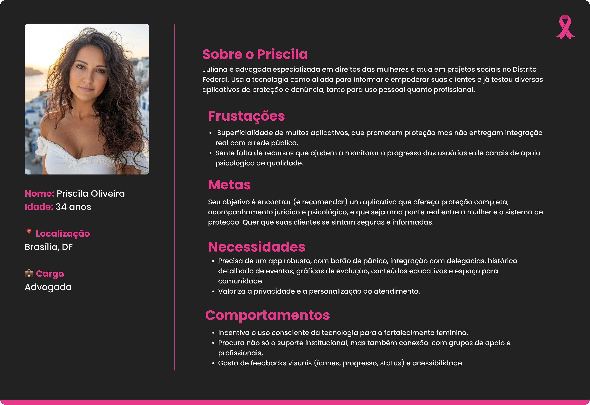
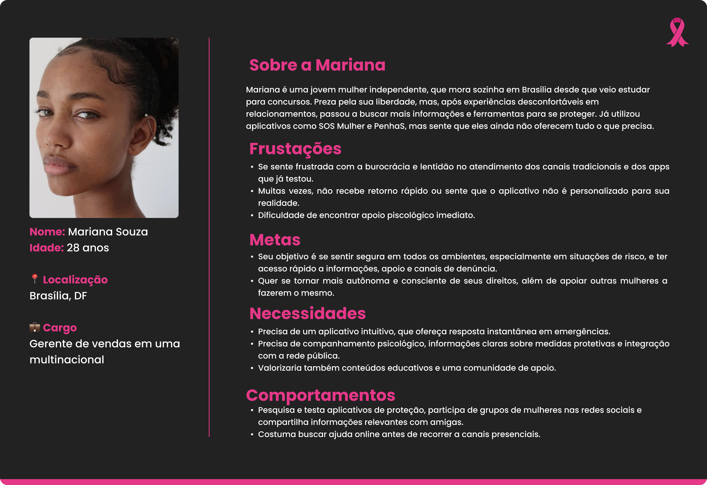
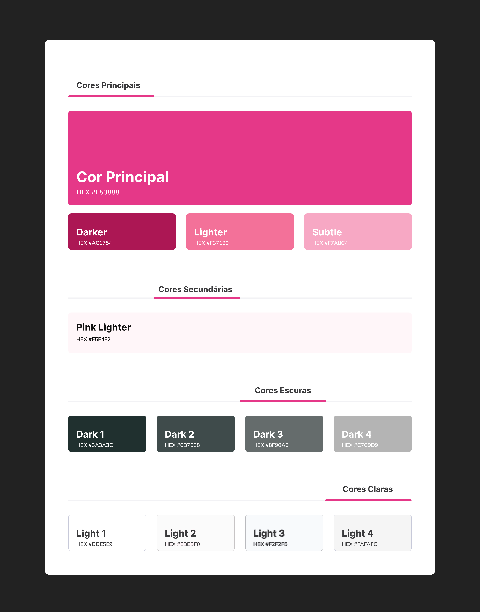

# WAD - Web Application Document - Módulo 2 - Inteli

**_Os trechos em itálico servem apenas como guia para o preenchimento da seção. Por esse motivo, não devem fazer parte da documentação final_**

## Nome do Grupo

#### Nomes dos integrantes do grupo

## Sumário

[1. Introdução](#c1)

[2. Visão Geral da Aplicação Web](#c2)

[3. Projeto Técnico da Aplicação Web](#c3)

[4. Desenvolvimento da Aplicação Web](#c4)

[5. Testes da Aplicação Web](#c5)

[6. Estudo de Mercado e Plano de Marketing](#c6)

[7. Conclusões e trabalhos futuros](#c7)

[8. Referências](c#8)

[Anexos](#c9)

 

# 1. Introdução (sprints 1 a 5)

A aplicação tem como objetivo enfrentar a vulnerabilidade de mulheres em situações de risco, especialmente em casos de violência. Muitas vezes, a ajuda não chega a tempo, as informações estão dispersas e a vítima não se sente segura para denunciar. Nesse contexto, observa-se uma lacuna na detecção de perigos, na conexão com redes de apoio e na oferta de um ambiente seguro.

A solução proposta é uma plataforma digital multifuncional, que combina inteligência artificial e georreferenciamento com uma abordagem humanizada. O sistema identifica áreas de risco e padrões de vulnerabilidade por meio de um modelo preditivo, permitindo ações preventivas e o acionamento automático de protocolos de emergência.

Além disso, a aplicação possibilita a conexão inteligente com redes de suporte, como contatos de confiança, delegacias online e centros de apoio psicológico. Destaca-se o botão de emergência discreto, que envia localização em tempo real e grava áudio e vídeo, oferecendo suporte em momentos críticos.

A plataforma também se diferencia pela personalização do atendimento, com chatbot emocional e direcionamento para profissionais. Funções como o modo camuflado e a discrição visual garantem a segurança da usuária.

Por fim, a proposta promove o empoderamento feminino, com ferramentas de autoavaliação de risco e espaços de compartilhamento. Assim, a aplicação atua de forma preventiva e reativa, contribuindo para a proteção, autonomia e bem-estar das mulheres.

# 2. Visão Geral da Aplicação Web (sprint 1)

## 2.1. Escopo do Projeto (sprints 1 e 4)

### 2.1.1. Modelo de 5 Forças de Porter (sprint 1)

 A análise das 5 Forças de Porter evidencia que o setor de aplicativos para prevenção da violência contra a mulher no Distrito Federal apresenta um ambiente altamente competitivo e dinâmico. A ameaça de novos entrantes é moderada, pois, embora o desenvolvimento técnico seja acessível, competir de fato requer inovação contínua, parcerias institucionais sólidas e credibilidade junto a órgãos públicos e usuárias. Além disso, a necessidade de aderência à legislação (LGPD) e integração com sistemas oficiais eleva as barreiras para novos concorrentes(Figura 1).  

Figura 1: Forças de Porter. 

 

Fonte: Material produzido pelos autores (2025). 

 A ameaça de produtos ou serviços substitutos é elevada, já que existem diversos aplicativos concorrentes e canais tradicionais, como Ligue 180, delegacias, redes sociais e grupos de apoio presencial. A diferenciação tecnológica, como o uso de IA preditiva, integração com a rede pública e resposta em tempo real, é fundamental para mitigar essa ameaça e reter as usuárias.  

 O poder de barganha dos fornecedores é moderado, pois o aplicativo depende de dados estratégicos, serviços de nuvem e integrações institucionais. A existência de múltiplos fornecedores reduz esse poder, mas a dependência de integrações oficiais pode aumentar custos e riscos operacionais.  

 O poder de barganha dos clientes é alto, já que as usuárias possuem múltiplas opções e exigem elevados padrões de segurança, privacidade e agilidade no atendimento. A insatisfação pode levar rapidamente à migração para soluções concorrentes, tornando essencial o foco em experiência do usuário e diferenciais claros.  

 Por fim, a rivalidade entre concorrentes é alta, com muitos aplicativos similares e canais tradicionais disputando a atenção das usuárias. A manutenção da relevância exige inovação tecnológica constante, engajamento ativo, campanhas educativas e integração com a comunidade e a rede pública.  

 Em síntese, o contexto da indústria demanda diferenciação tecnológica, integração institucional e foco contínuo na experiência e segurança das usuárias para garantir competitividade e relevância no mercado.  

### 2.1.2. Análise SWOT da Instituição Parceira (sprint 1)

 A instituição parceira destaca-se pela inovação tecnológica, integração com a rede pública e foco em segurança e privacidade. Contudo, enfrenta desafios como dependência de dados externos, recursos limitados e alta rivalidade no setor. As oportunidades incluem expansão regional e novas tecnologias, enquanto as ameaças abrangem concorrência intensa, mudanças regulatórias e riscos de segurança digital.  

Figura 2: Analise Swot. 

 

Fonte: Material produzido pelos autores (2025). 

### 2.1.3. Solução (sprints 1 a 5)

1. Problema a ser resolvido
A violência contra a mulher no Distrito Federal persiste como um grave desafio, marcado por resposta lenta em emergências, pouca integração dos sistemas públicos e dificuldade de acesso a informações e suporte contínuo.

2. Dados disponíveis
Serão utilizados dados públicos do IBGE, SINAN e órgãos do DF, além de integrações com ONGs e APIs institucionais, abrangendo estatísticas de violência, localização de serviços e histórico de denúncias.

3. Solução proposta
O projeto consiste em um aplicativo mobile que integra botão de emergência, formulário de avaliação de risco, chat com IA, módulos educativos, mapa da rede de proteção e dashboards em tempo real, priorizando privacidade e integração com serviços públicos.

4. Forma de utilização da solução
Usuárias acessam o app para identificar situações de risco, acionar ajuda imediata, receber suporte emocional, consultar informações, localizar serviços e acompanhar sua evolução, tudo de forma intuitiva e segura.

5. Benefícios esperados
A solução deve ampliar o acesso à rede de proteção, reduzir o tempo de resposta em emergências, promover autonomia, facilitar a autopercepção do risco e fortalecer o vínculo entre vítimas e serviços de apoio.

6. Critério de sucesso e como será avaliado
O sucesso será avaliado pelo aumento do número de mulheres atendidas, redução do tempo de resposta em emergências, engajamento nos módulos educativos, satisfação das usuárias e integração efetiva com a rede pública, monitorados por indicadores e feedbacks contínuos.

### 2.1.4. Value Proposition Canvas (sprint 1): 

O Canvas da Proposta de Valor do aplicativo "Caminho Seguro" foi desenvolvido para alinhar profundamente as necessidades das mulheres em situação de vulnerabilidade com as soluções tecnológicas mais inovadoras e acolhedoras disponíveis atualmente. O perfil do cliente foi cuidadosamente mapeado, destacando tarefas essenciais como identificar riscos de violência, buscar apoio rápido, acessar informações confiáveis sobre direitos e medidas protetivas, compartilhar experiências e acompanhar seu progresso em autonomia e segurança. Essas tarefas refletem tanto as demandas urgentes de proteção quanto o desejo de evolução e pertencimento das usuárias (Figura 3).

Figura 3: Canvas Proposta de Valor . 

 

Fonte: Material produzido pelos autores (2025). 

As dores identificadas incluem a dificuldade de acesso rápido à rede de proteção, falta de integração entre sistemas, resposta lenta em emergências, privacidade insuficiente, ausência de acompanhamento psicológico e sensação de isolamento. Esses pontos críticos foram endereçados com aliviadores de dor, como resposta instantânea em emergências, privacidade robusta com criptografia e camuflagem, atendimento humanizado via IA e integração de dados oficiais, facilitando o acesso a recursos psicológicos e jurídicos sem burocracia.

Os ganhos esperados pelas usuárias — autonomia, proteção, evolução, apoio psicológico e pertencimento — são potencializados por criadores de ganho como o acompanhamento de progresso com dashboards, conteúdos educativos validados, comunidade ativa, trilhas personalizadas e integração com a rede pública. O aplicativo proporciona uma experiência de empoderamento, permitindo que cada mulher visualize sua evolução, conquiste autonomia e se sinta parte de uma rede de apoio acolhedora.

No mapa de valor, os produtos e serviços oferecidos — como o app mobile, botão de emergência, chat com IA, mapa interativo, módulos educativos, dashboards e ferramentas de privacidade — são diretamente alinhados às tarefas, dores e ganhos das usuárias. A proposta de valor se diferencia pela inovação tecnológica (IA preditiva, monitoramento em tempo real), foco em segurança e privacidade, acolhimento, empoderamento e potencial de escalabilidade nacional. Assim, o "Caminho Seguro" não apenas resolve dores reais, mas também cria valor sustentável e impacto social direto, superando concorrentes ao unir tecnologia, acolhimento e integração institucional.

## 2.2. Personas (sprint 1)

# 3. Projeto da Aplicação Web (sprints 1 a 4)

## 3.1. Arquitetura (sprints 3 e 4)

*Posicione aqui o diagrama de arquitetura da sua solução de aplicação web. Atualize sempre que necessário*

## 3.2. Wireframes (sprint 2)

*Posicione aqui as imagens do wireframe construído para sua solução e, opcionalmente, o link para acesso (mantenha o link sempre público para visualização)*

## 3.3. Guia de estilos (sprint 3)

O guia de estilos tem como objetivo garantir consistência visual e funcional em toda a interface da aplicação. Ele atua como referência central para desenvolvedores e designers, padronizando o uso de cores e tipografias. Ao fortalecer a identidade da plataforma, o guia reduz ambiguidades na construção de interfaces e assegura acessibilidade, coerência visual e escalabilidade entre diferentes módulos da aplicação, sejam eles voltados ao público geral, à rede de apoio ou às autoridades parceiras. Seguir suas diretrizes evita o uso inadequado de estilos, promovendo uma estética unificada e acolhedora, alinhada aos valores centrais da solução: proteção, empatia, privacidade e empoderamento feminino.

### 3.3.1 Cores

A paleta de cores é um elemento fundamental na construção visual da aplicação, pois garante que a mensagem correta seja transmitida à usuária, reforçando, de maneira sutil, os valores, o propósito e as emoções que a solução deseja despertar. No caso da aplicação, a escolha das cores foi orientada por princípios de contraste, acessibilidade e hierarquia visual, de modo a promover uma experiência intuitiva, acolhedora e segura.

A cor principal é um tom vibrante de rosa, que representa força, acolhimento e empatia, características essenciais para o público-alvo da plataforma. Essa cor é utilizada em elementos interativos de destaque, como botões, ícones de alerta, títulos e links importantes. Suas variações — um rosa mais escuro, um tom claro e uma versão sutil — são aplicadas conforme o nível de ênfase desejado e mantêm a coerência visual em diferentes contextos da interface.

Como cor secundária, foi adotado um rosa suave, associado à autonomia, resiliência e transformação. Para garantir legibilidade e acessibilidade, os textos utilizam tons escuros sobre fundos claros, e tons claros sobre fundos escuros ou coloridos.

Cada cor da paleta cumpre uma função específica — seja decorativa, informativa ou estrutural — e foi selecionada estrategicamente para reforçar a identidade do aplicativo, promovendo uma navegação clara, respeitosa e centrada no bem-estar das mulheres em situação de vulnerabilidade.

Figura x: Cores. 

 

Fonte: Material produzido pelos autores (2025). 

### 3.3.2 Tipografia

A tipografia adotada na aplicação foi escolhida com base em critérios de legibilidade, simplicidade e coerência visual. A utilização de uma única família tipográfica em toda a interface contribui para a uniformidade do design e facilita a leitura em diferentes dispositivos.

As variações de peso e estilo da fonte são aplicadas de forma estratégica para estabelecer uma hierarquia clara entre os elementos textuais. Títulos e chamadas de ação utilizam pesos mais marcantes para atrair a atenção do usuário, enquanto textos descritivos e informativos mantêm um estilo mais leve e equilibrado, promovendo uma leitura fluida e confortável.

Informações secundárias, como instruções breves ou detalhes complementares, são apresentadas com pesos mais sutis, evitando sobrecarga visual. Essa abordagem permite que o conteúdo seja rapidamente interpretado, mesmo em contextos de uso sob pressão ou urgência, como é comum em situações de risco.

Além disso, a escolha tipográfica respeita os princípios de acessibilidade, garantindo contraste adequado, espaçamento entre linhas e boa adaptação em diferentes tamanhos de tela. Dessa forma, reforça-se o compromisso da solução com a inclusão, o acolhimento e a experiência da usuária.

Figura x: Tipografia. 

 

Fonte: Material produzido pelos autores (2025). 

## 3.4 Protótipo de alta fidelidade (sprint 3)

*posicione aqui algumas imagens demonstrativas de seu protótipo de alta fidelidade e o link para acesso ao protótipo completo (mantenha o link sempre público para visualização)*

## 3.5. Modelagem do banco de dados (sprints 2 e 4)

### 3.5.1. Modelo relacional (sprints 2 e 4)

*posicione aqui os diagramas de modelos relacionais do seu banco de dados, apresentando todos os esquemas de tabelas e suas relações. Utilize texto para complementar suas explicações, se necessário* 

### 3.5.2. Consultas SQL e lógica proposicional (sprint 2)

*posicione aqui uma lista de consultas SQL compostas, realizadas pelo back-end da aplicação web, com sua respectiva lógica proposicional, descrita conforme template abaixo. Lembre-se que para usar LaTeX em markdown, basta você colocar as expressões entre $ ou $$*

*Template de SQL + lógica proposicional*
#1 | ---
--- | ---
**Expressão SQL** | SELECT * FROM suppliers WHERE (state = 'California' AND supplier_id <> 900) OR (supplier_id = 100); 
**Proposições lógicas** | $A$: O estado é 'California' (state = 'California')   $B$: O ID do fornecedor não é 900 (supplier_id ≠ 900)   $C$: O ID do fornecedor é 100 (supplier_id = 100)
**Expressão lógica proposicional** | $(A \land B) \lor C$
**Tabela Verdade** | <table> <thead> <tr> <th>$A$</th> <th>$B$</th> <th>$C$</th> <th>$(A \land B)$</th> <th>$(A \land B) \lor C$</th> </tr> </thead> <tbody> <tr> <td>F</td> <td>F</td> <td>F</td> <td>F</td> <td>F</td> </tr> <tr> <td>F</td> <td>F</td> <td>V</td> <td>F</td> <td>V</td> </tr> <tr> <td>F</td> <td>V</td> <td>F</td> <td>F</td> <td>F</td> </tr> <tr> <td>F</td> <td>V</td> <td>V</td> <td>F</td> <td>V</td> </tr> <tr> <td>V</td> <td>F</td> <td>F</td> <td>F</td> <td>F</td> </tr> <tr> <td>V</td> <td>F</td> <td>V</td> <td>F</td> <td>V</td> </tr> <tr> <td>V</td> <td>V</td> <td>F</td> <td>V</td> <td>V</td> </tr> <tr> <td>V</td> <td>V</td> <td>V</td> <td>V</td> <td>V</td> </tr> </tbody> </table>

*Dica: edite a tabela verdade fora do markdown, para ter melhor controle*

## 3.6. WebAPI e endpoints (sprints 3 e 4)

*Utilize um link para outra página de documentação contendo a descrição completa de cada endpoint. Ou descreva aqui cada endpoint criado para seu sistema.* 

*Cada endpoint deve conter endereço, método (GET, POST, PUT, PATCH, DELETE), header, body e formatos de response*

# 4. Desenvolvimento da Aplicação Web

## 4.1. Primeira versão da aplicação web (sprint 3)

*Descreva e ilustre aqui o desenvolvimento da sua primeira versão do sistema web, explicando brevemente o que foi entregue em termos de código e sistema. Utilize prints de tela para ilustrar. Indique as eventuais dificuldades e próximos passos.*

## 4.2. Segunda versão da aplicação web (sprint 4)

*Descreva e ilustre aqui o desenvolvimento da sua segunda versão do sistema web, explicando brevemente o que foi entregue em termos de código e sistema. Utilize prints de tela para ilustrar. Indique as eventuais dificuldades e próximos passos.*

## 4.3. Versão final da aplicação web (sprint 5)

*Descreva e ilustre aqui o desenvolvimento da última versão do sistema web, explicando brevemente o que foi entregue em termos de código e sistema. Utilize prints de tela para ilustrar. Indique as eventuais dificuldades e próximos passos.*

# 5. Testes

## 5.1. Relatório de testes de integração de endpoints automatizados (sprint 4)

*Liste e descreva os testes unitários dos endpoints criados, automatizados e planejados para sua solução. Posicione aqui também o relatório de cobertura de testes Jest se houver (através de link ou transcrito para estrutura markdown)*

## 5.2. Testes de usabilidade (sprint 5)

*Posicione aqui as tabelas com enunciados de tarefas, etapas e resultados de testes de usabilidade. Ou utilize um link para seu relatório de testes (mantenha o link sempre público para visualização)*

# 6. Estudo de Mercado e Plano de Marketing (sprint 4)

## 6.1 Resumo Executivo

*Preencher com até 300 palavras, sem necessidade de fonte*

*Apresente de forma clara e objetiva os principais destaques do projeto: oportunidades de mercado, diferenciais competitivos da aplicação web e os objetivos estratégicos pretendidos.*

## 6.2 Análise de Mercado

*a) Visão Geral do Setor (até 250 palavras)*
*Contextualize o setor no qual a aplicação está inserida, considerando aspectos econômicos, tecnológicos e regulatórios. Utilize fontes confiáveis.*

*b) Tamanho e Crescimento do Mercado (até 250 palavras)*
*Apresente dados quantitativos sobre o tamanho atual e projeções de crescimento do mercado. Utilize fontes confiáveis.*

*c) Tendências de Mercado (até 300 palavras)*
*Identifique e analise tendências relevantes (tecnológicas, comportamentais e mercadológicas) que influenciam o setor. Utilize fontes confiáveis.*

## 6.3 Análise da Concorrência

*a) Principais Concorrentes (até 250 palavras)*
*Liste os concorrentes diretos e indiretos, destacando suas principais características e posicionamento no mercado.*

*b) Vantagens Competitivas da Aplicação Web (até 250 palavras)*
*Descreva os diferenciais da sua aplicação em relação aos concorrentes, sem necessidade de citação de fontes.*

## 6.4 Público-Alvo

*a) Segmentação de Mercado (até 250 palavras)*
Descreva os principais segmentos de mercado a serem atendidos pela aplicação. Utilize bases de dados e fontes confiáveis.*

*b) Perfil do Público-Alvo (até 250 palavras)*
*Caracterize o público-alvo com dados demográficos, psicográficos e comportamentais, incluindo necessidades específicas. Utilize fontes obrigatórias.*

## 6.5 Posicionamento

*a) Proposta de Valor Única (até 250 palavras)*
*Defina de maneira clara o que torna a sua aplicação única e valiosa para o mercado.*

*b) Estratégia de Diferenciação (até 250 palavras)*
*Explique como sua aplicação se destacará da concorrência, evidenciando a lógica por trás do posicionamento.*

## 6.6 Estratégia de Marketing 

*a) Produto/Serviço (até 200 palavras)*
*Descreva as funcionalidades, benefícios e diferenciais da aplicação*

*b) Preço (até 200 palavras)*
*Explique o modelo de precificação adotado e justifique com base nas análises anteriores.*

*c) Praça (Distribuição) (até 200 palavras)*
*Apresente os canais digitais utilizados para distribuir e entregar a aplicação ao público.*

*d) Promoção (até 200 palavras)*
*Descreva as estratégias digitais planejadas, como SEO, redes sociais, marketing de conteúdo e campanhas pagas.*

# 7. Conclusões e trabalhos futuros (sprint 5)

*Escreva de que formas a solução da aplicação web atingiu os objetivos descritos na seção 2 deste documento. Indique pontos fortes e pontos a melhorar de maneira geral.*

*Relacione os pontos de melhorias evidenciados nos testes com planos de ações para serem implementadas. O grupo não precisa implementá-las, pode deixar registrado aqui o plano para ações futuras*

*Relacione também quaisquer outras ideias que o grupo tenha para melhorias futuras*

# 8. Referências (sprints 1 a 5)

_Incluir as principais referências de seu projeto, para que seu parceiro possa consultar caso ele se interessar em aprofundar. Um exemplo de referência de livro e de site:_ 

LUCK, Heloisa. Liderança em gestão escolar. 4. ed. Petrópolis: Vozes, 2010.  
SOBRENOME, Nome. Título do livro: subtítulo do livro. Edição. Cidade de publicação: Nome da editora, Ano de publicação.  

INTELI. Adalove. Disponível em: https://adalove.inteli.edu.br/feed. Acesso em: 1 out. 2023  
SOBRENOME, Nome. Título do site. Disponível em: link do site. Acesso em: Dia Mês Ano

# Anexos

*Inclua aqui quaisquer complementos para seu projeto, como diagramas, imagens, tabelas etc. Organize em sub-tópicos utilizando headings menores (use ## ou ### para isso)*