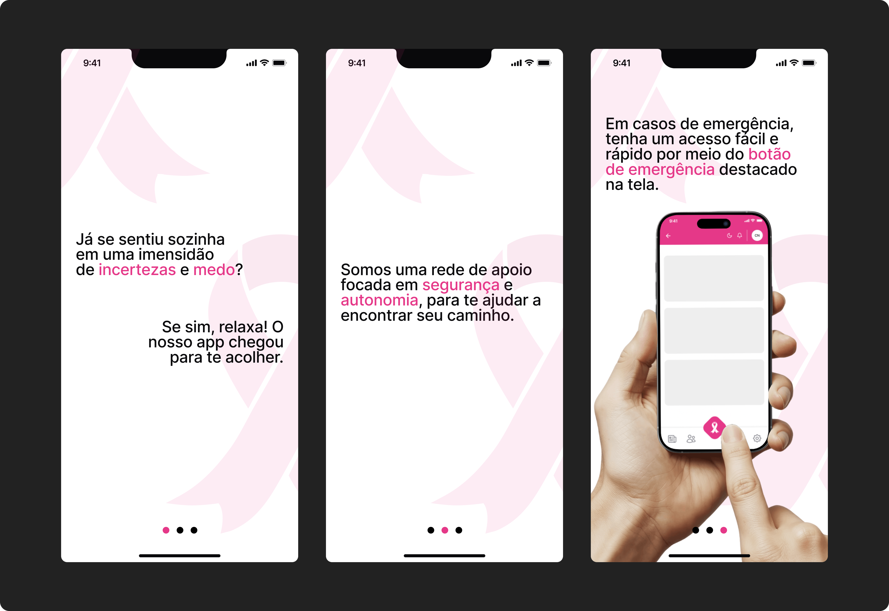
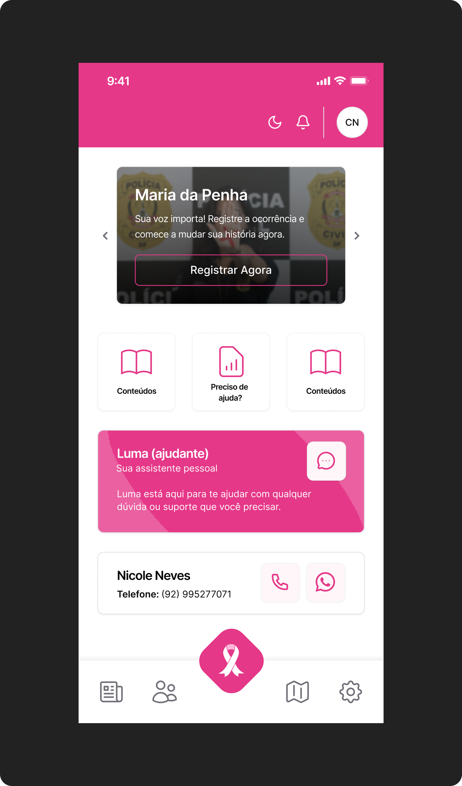
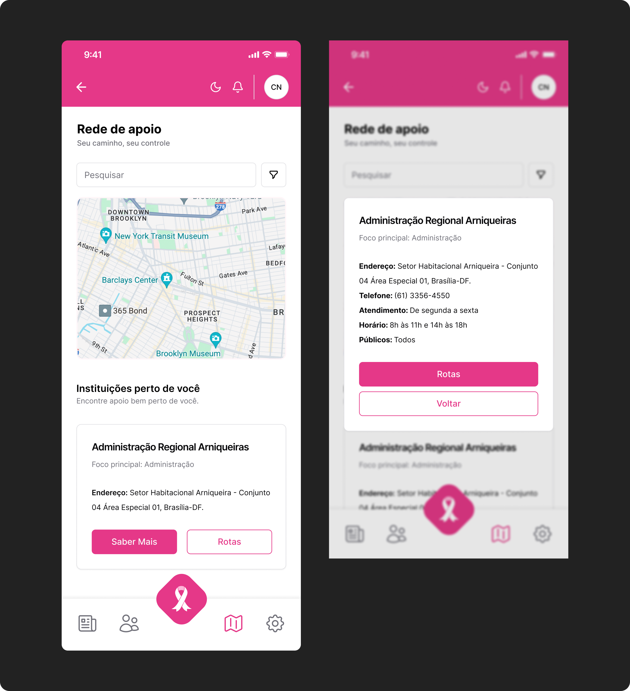
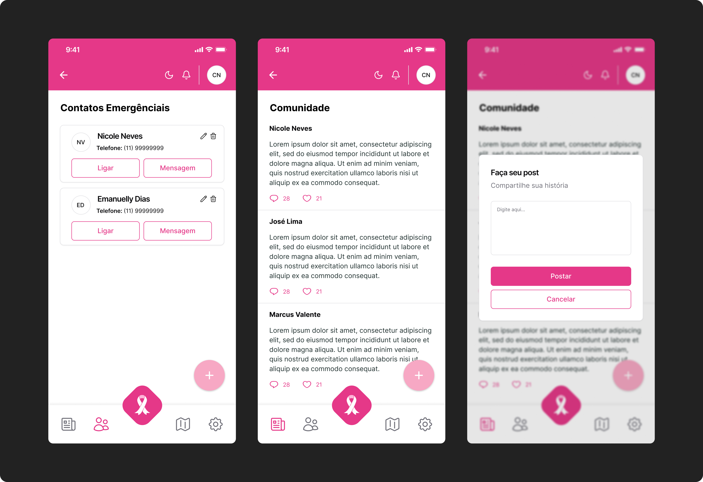
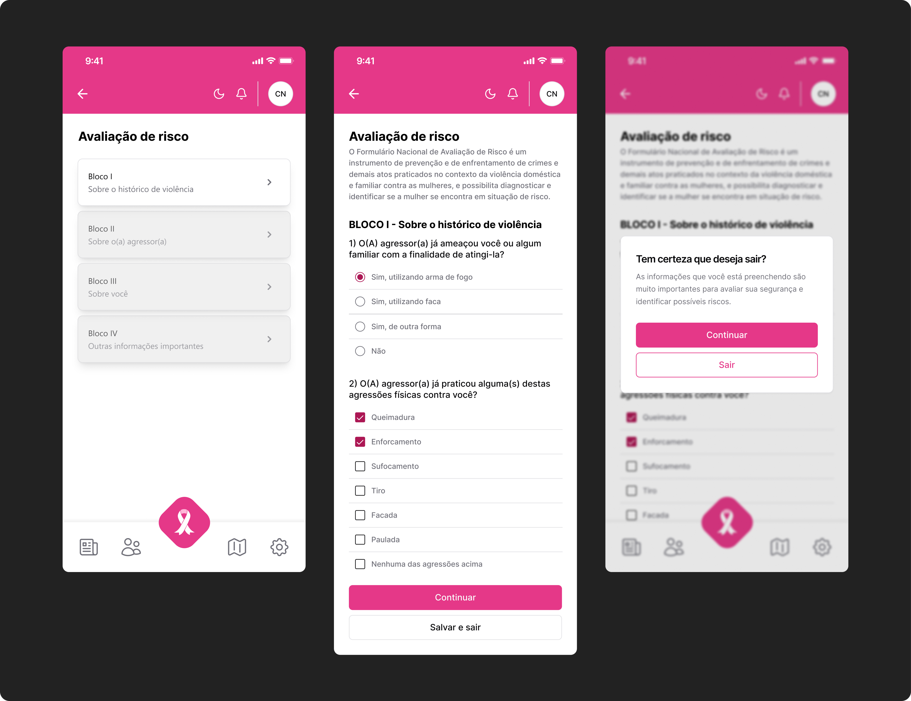
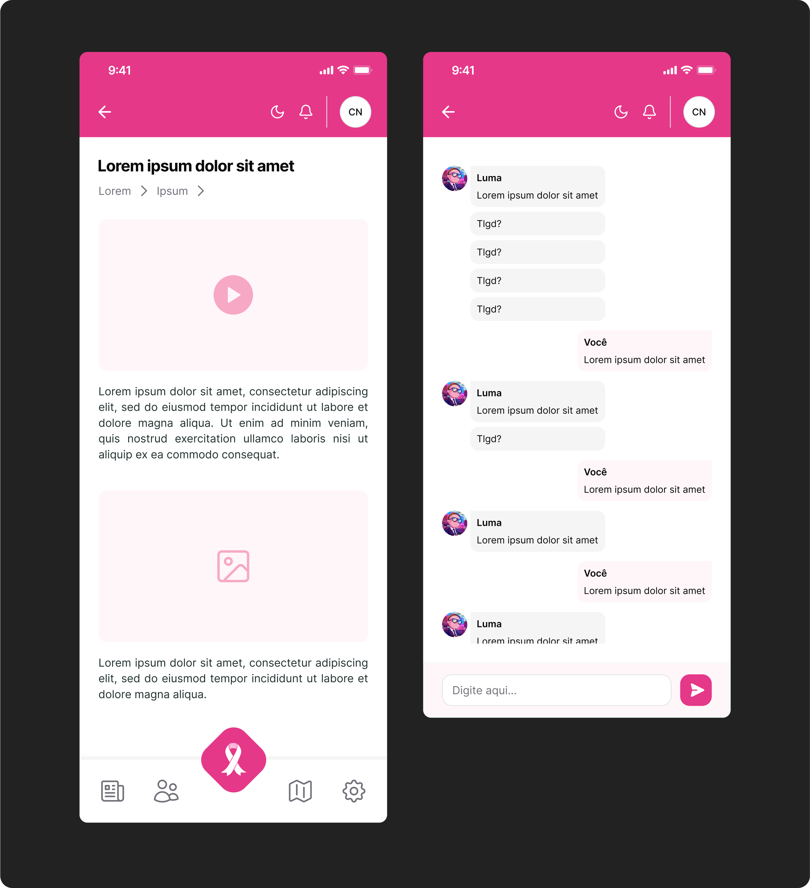
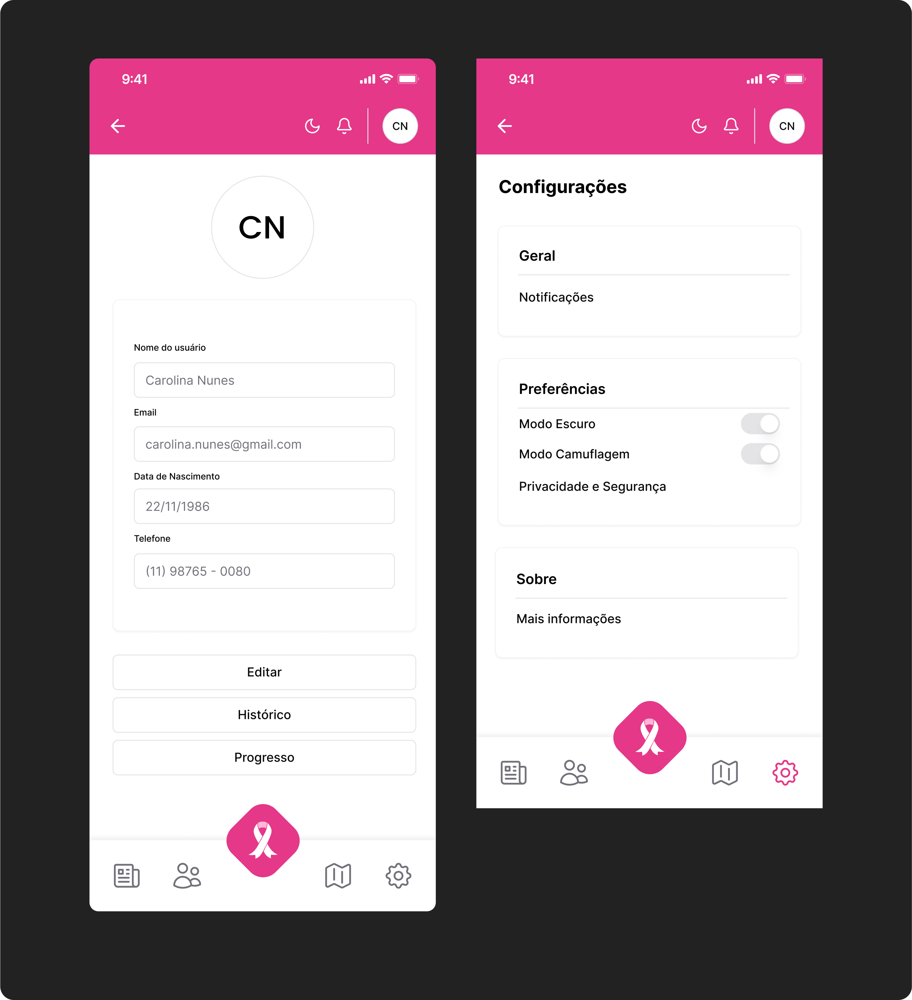

## Nome do Grupo

#### Nomes dos integrantes do grupo

## Sumário

[1. Introdução](#c1)

[2. Visão Geral da Aplicação Web](#c2)

[3. Projeto Técnico da Aplicação Web](#c3)

[4. Estudo de Mercado e Plano de Marketing](#c6)

[5. Conclusões e trabalhos futuros](#c7)

[6. Referências](c#8)

[Anexos](#c9)

 

# 1. Introdução

A aplicação tem como objetivo enfrentar a vulnerabilidade de mulheres em situações de risco, especialmente em casos de violência. Muitas vezes, a ajuda não chega a tempo, as informações estão dispersas e a vítima não se sente segura para denunciar. Nesse contexto, observa-se uma lacuna na detecção de perigos, na conexão com redes de apoio e na oferta de um ambiente seguro.

A solução proposta é uma plataforma digital multifuncional, que combina inteligência artificial e georreferenciamento com uma abordagem humanizada. O sistema identifica áreas de risco e padrões de vulnerabilidade por meio de um modelo preditivo, permitindo ações preventivas e o acionamento automático de protocolos de emergência.

Além disso, a aplicação possibilita a conexão inteligente com redes de suporte, como contatos de confiança, delegacias online e centros de apoio psicológico. Destaca-se o botão de emergência discreto, que envia localização em tempo real e grava áudio e vídeo, oferecendo suporte em momentos críticos.

A plataforma também se diferencia pela personalização do atendimento, com chatbot emocional e direcionamento para profissionais. Funções como o modo camuflado e a discrição visual garantem a segurança da usuária.

Por fim, a proposta promove o empoderamento feminino, com ferramentas de autoavaliação de risco e espaços de compartilhamento. Assim, a aplicação atua de forma preventiva e reativa, contribuindo para a proteção, autonomia e bem-estar das mulheres.

# 2. Visão Geral da Aplicação Web

## 2.1. Escopo do Projeto 

### 2.1.1. Modelo de 5 Forças de Porter 

 A análise das 5 Forças de Porter evidencia que o setor de aplicativos para prevenção da violência contra a mulher no Distrito Federal apresenta um ambiente altamente competitivo e dinâmico. A ameaça de novos entrantes é moderada, pois, embora o desenvolvimento técnico seja acessível, competir de fato requer inovação contínua, parcerias institucionais sólidas e credibilidade junto a órgãos públicos e usuárias. Além disso, a necessidade de aderência à legislação (LGPD) e integração com sistemas oficiais eleva as barreiras para novos concorrentes(Figura 1).  

Figura 1: Forças de Porter. 

 

Fonte: Material produzido pelos autores (2025). 

 A ameaça de produtos ou serviços substitutos é elevada, já que existem diversos aplicativos concorrentes e canais tradicionais, como Ligue 180, delegacias, redes sociais e grupos de apoio presencial. A diferenciação tecnológica, como o uso de IA preditiva, integração com a rede pública e resposta em tempo real, é fundamental para mitigar essa ameaça e reter as usuárias.  

 O poder de barganha dos fornecedores é moderado, pois o aplicativo depende de dados estratégicos, serviços de nuvem e integrações institucionais. A existência de múltiplos fornecedores reduz esse poder, mas a dependência de integrações oficiais pode aumentar custos e riscos operacionais.  

 O poder de barganha dos clientes é alto, já que as usuárias possuem múltiplas opções e exigem elevados padrões de segurança, privacidade e agilidade no atendimento. A insatisfação pode levar rapidamente à migração para soluções concorrentes, tornando essencial o foco em experiência do usuário e diferenciais claros.  

 Por fim, a rivalidade entre concorrentes é alta, com muitos aplicativos similares e canais tradicionais disputando a atenção das usuárias. A manutenção da relevância exige inovação tecnológica constante, engajamento ativo, campanhas educativas e integração com a comunidade e a rede pública.  

 Em síntese, o contexto da indústria demanda diferenciação tecnológica, integração institucional e foco contínuo na experiência e segurança das usuárias para garantir competitividade e relevância no mercado.  

### 2.1.2. Análise SWOT da Instituição Parceira 

 A instituição parceira destaca-se pela inovação tecnológica, integração com a rede pública e foco em segurança e privacidade. Contudo, enfrenta desafios como dependência de dados externos, recursos limitados e alta rivalidade no setor. As oportunidades incluem expansão regional e novas tecnologias, enquanto as ameaças abrangem concorrência intensa, mudanças regulatórias e riscos de segurança digital.  

Figura 2: Analise Swot. 

 

Fonte: Material produzido pelos autores (2025). 

### 2.1.3. Solução

1. Problema a ser resolvido  
A violência contra a mulher no Distrito Federal persiste como um grave desafio, marcado por resposta lenta em emergências, pouca integração dos sistemas públicos e dificuldade de acesso a informações e suporte contínuo.

2. Dados disponíveis  
Serão utilizados dados públicos do IBGE, SINAN e órgãos do DF, além de integrações com ONGs e APIs institucionais, abrangendo estatísticas de violência, localização de serviços e histórico de denúncias.

3. Solução proposta  
O projeto consiste em um aplicativo mobile que integra botão de emergência, formulário de avaliação de risco, chat com IA, módulos educativos, mapa da rede de proteção e dashboards em tempo real, priorizando privacidade e integração com serviços públicos.

4. Forma de utilização da solução  
Usuárias acessam o app para identificar situações de risco, acionar ajuda imediata, receber suporte emocional, consultar informações, localizar serviços e acompanhar sua evolução, tudo de forma intuitiva e segura.

5. Benefícios esperados  
A solução deve ampliar o acesso à rede de proteção, reduzir o tempo de resposta em emergências, promover autonomia, facilitar a autopercepção do risco e fortalecer o vínculo entre vítimas e serviços de apoio.

6. Critério de sucesso e como será avaliado  
O sucesso será avaliado pelo aumento do número de mulheres atendidas, redução do tempo de resposta em emergências, engajamento nos módulos educativos, satisfação das usuárias e integração efetiva com a rede pública, monitorados por indicadores e feedbacks contínuos.

### 2.1.4. Value Proposition Canvas

O Canvas da Proposta de Valor da aplicação foi desenvolvido para alinhar profundamente as necessidades das mulheres em situação de vulnerabilidade com as soluções tecnológicas mais inovadoras e acolhedoras disponíveis atualmente. O perfil do cliente foi cuidadosamente mapeado, destacando tarefas essenciais como identificar riscos de violência, buscar apoio rápido, acessar informações confiáveis sobre direitos e medidas protetivas, compartilhar experiências e acompanhar seu progresso em autonomia e segurança. Essas tarefas refletem tanto as demandas urgentes de proteção quanto o desejo de evolução e pertencimento das usuárias (Figura 3).

Figura 3: Canvas Proposta de Valor . 

 

Fonte: Material produzido pelos autores (2025). 

As dores identificadas incluem a dificuldade de acesso rápido à rede de proteção, falta de integração entre sistemas, resposta lenta em emergências, privacidade insuficiente, ausência de acompanhamento psicológico e sensação de isolamento. Esses pontos críticos foram endereçados com aliviadores de dor, como resposta instantânea em emergências, privacidade robusta com criptografia e camuflagem, atendimento humanizado via IA e integração de dados oficiais, facilitando o acesso a recursos psicológicos e jurídicos sem burocracia.

Os ganhos esperados pelas usuárias — autonomia, proteção, evolução, apoio psicológico e pertencimento — são potencializados por criadores de ganho como o acompanhamento de progresso com dashboards, conteúdos educativos validados, comunidade ativa, trilhas personalizadas e integração com a rede pública. O aplicativo proporciona uma experiência de empoderamento, permitindo que cada mulher visualize sua evolução, conquiste autonomia e se sinta parte de uma rede de apoio acolhedora.

No mapa de valor, os produtos e serviços oferecidos — como o app mobile, botão de emergência, chat com IA, mapa interativo, módulos educativos, dashboards e ferramentas de privacidade — são diretamente alinhados às tarefas, dores e ganhos das usuárias. A proposta de valor se diferencia pela inovação tecnológica (IA preditiva, monitoramento em tempo real), foco em segurança e privacidade, acolhimento, empoderamento e potencial de escalabilidade nacional. Assim, a aplicação não apenas resolve dores reais, mas também cria valor sustentável e impacto social direto, superando concorrentes ao unir tecnologia, acolhimento e integração institucional.

## 2.2. Personas

As personas ajudam a guiar o desenvolvimento da aplicação, garantindo que tudo esteja alinhado às necessidades reais do público. Elas representam perfis fictícios baseados em dados, que resumem quem são as usuárias, o que enfrentam e o que buscam.

A seguir, são apresentadas as duas principais personas identificadas para a aplicação:

Priscila é uma mulher de 32 anos, residente em área urbana do Distrito Federal, que já vivenciou situações de risco e busca maior autonomia e segurança em seu dia a dia. Ela valoriza privacidade, agilidade no atendimento e acesso fácil a canais de denúncia e suporte emocional. Priscila utiliza frequentemente o smartphone para se informar e se conectar com redes de apoio.

Mariana tem 24 anos, é estudante universitária e participa de grupos de apoio e projetos sociais voltados à proteção de mulheres. Ela busca informações confiáveis sobre direitos, deseja compartilhar experiências e contribuir para o empoderamento coletivo. Mariana valoriza soluções intuitivas, seguras e integradas à rede pública.

Essas personas guiam as decisões de design, funcionalidades e comunicação da aplicação, assegurando que a aplicação seja relevante, acolhedora e eficiente.

# 3. Projeto da Aplicação Web 

## 3.1. Guia de estilos 

O guia de estilos tem como objetivo garantir consistência visual e funcional em toda a interface da aplicação. Ele atua como referência central para desenvolvedores e designers, padronizando o uso de cores e tipografias. Ao fortalecer a identidade da plataforma, o guia reduz ambiguidades na construção de interfaces e assegura acessibilidade, coerência visual e escalabilidade entre diferentes módulos da aplicação, sejam eles voltados ao público geral, à rede de apoio ou às autoridades parceiras. Seguir suas diretrizes evita o uso inadequado de estilos, promovendo uma estética unificada e acolhedora, alinhada aos valores centrais da solução: proteção, empatia, privacidade e empoderamento feminino.

### 3.2. Cores

A paleta de cores é um elemento fundamental na construção visual da aplicação, pois garante que a mensagem correta seja transmitida à usuária, reforçando, de maneira sutil, os valores, o propósito e as emoções que a solução deseja despertar. No caso da aplicação, a escolha das cores foi orientada por princípios de contraste, acessibilidade e hierarquia visual, de modo a promover uma experiência intuitiva, acolhedora e segura.

A cor principal é um tom vibrante de rosa, que representa força, acolhimento e empatia, características essenciais para o público-alvo da plataforma. Essa cor é utilizada em elementos interativos de destaque, como botões, ícones de alerta, títulos e links importantes. Suas variações — um rosa mais escuro, um tom claro e uma versão sutil — são aplicadas conforme o nível de ênfase desejado e mantêm a coerência visual em diferentes contextos da interface.

Como cor secundária, foi adotado um rosa suave, associado à autonomia, resiliência e transformação. Para garantir legibilidade e acessibilidade, os textos utilizam tons escuros sobre fundos claros, e tons claros sobre fundos escuros ou coloridos.

Cada cor da paleta cumpre uma função específica — seja decorativa, informativa ou estrutural — e foi selecionada estrategicamente para reforçar a identidade do aplicativo, promovendo uma navegação clara, respeitosa e centrada no bem-estar das mulheres em situação de vulnerabilidade.

Figura x: Cores. 

 

Fonte: Material produzido pelos autores (2025). 

### 3.3. Tipografia

A tipografia adotada na aplicação foi escolhida com base em critérios de legibilidade, simplicidade e coerência visual. A utilização de uma única família tipográfica em toda a interface contribui para a uniformidade do design e facilita a leitura em diferentes dispositivos.

As variações de peso e estilo da fonte são aplicadas de forma estratégica para estabelecer uma hierarquia clara entre os elementos textuais. Títulos e chamadas de ação utilizam pesos mais marcantes para atrair a atenção do usuário, enquanto textos descritivos e informativos mantêm um estilo mais leve e equilibrado, promovendo uma leitura fluida e confortável.

Informações secundárias, como instruções breves ou detalhes complementares, são apresentadas com pesos mais sutis, evitando sobrecarga visual. Essa abordagem permite que o conteúdo seja rapidamente interpretado, mesmo em contextos de uso sob pressão ou urgência, como é comum em situações de risco.

Além disso, a escolha tipográfica respeita os princípios de acessibilidade, garantindo contraste adequado, espaçamento entre linhas e boa adaptação em diferentes tamanhos de tela. Dessa forma, reforça-se o compromisso da solução com a inclusão, o acolhimento e a experiência da usuária.

Figura x: Tipografia. 

 

Fonte: Material produzido pelos autores (2025). 

## 3.4 Protótipo de alta fidelidade

O protótipo de alta fidelidade éproporciona uma representação visual detalhada da aplicação. Ele simula de forma fiel o design, as interações e a experiência do usuário, utilizando cores, tipografia, ícones, botões e demais elementos gráficos compatíveis com o produto final.

Esse tipo de protótipo permite validar decisões de design antes do início do desenvolvimento, testar a usabilidade com usuários reais e apresentar a solução de forma visual e funcional a stakeholders.

O protótipo completo pode ser acessado através da plataforma Figma, por meio do seguinte link: [Acessar protótipo](https://www.figma.com/design/gBgPyZzconORqmgYv9R5rT/fourYOU?node-id=27-23&p=f&t=jfBAJLeckyY9Dy9L-0)

A seguir estão as telas prototipadas, que ilustram as principais funcionalidades da aplicação:

Figura x: Telas de Introdução. 

 

Fonte: Material produzido pelos autores (2025). 

As telas de introdução têm como objetivo apresentar o propósito da aplicação logo no primeiro acesso da usuária. Elas destacam os pilares da plataforma — proteção, acolhimento e orientação — promovendo uma conexão emocional inicial com a proposta do sistema. Além disso, oferecem uma visão clara e objetiva sobre a utilidade e o impacto da aplicação na vida de mulheres em situação de vulnerabilidade.

Figura x: Telas de Login e Cadastro. 

 

Fonte: Material produzido pelos autores (2025). 

As telas de login e cadastro são projetadas para serem intuitivas e seguras, permitindo que as usuárias acessem rapidamente suas contas ou criem novas, com foco na privacidade e proteção dos dados pessoais.

Figura x: Tela Home. 

 

Fonte: Material produzido pelos autores (2025). 

A tela inicial (Home) funciona como o painel principal da aplicação, permitindo o acesso direto às funcionalidades mais importantes: botão de emergência, avaliação de risco e suporte emocional. A navegação foi planejada para ser simples e acessível, com foco em clareza, legibilidade e facilidade de uso, mesmo em situações de estresse ou urgência.

Figura x: Tela do Mapa. 

 

Fonte: Material produzido pelos autores (2025). 

O mapa interativo utiliza geolocalização para exibir pontos da rede de apoio disponíveis nas proximidades da usuária, como delegacias especializadas, centros de referência e etc. A funcionalidade é essencial para garantir respostas rápidas e seguras em momentos críticos, otimizando o deslocamento até locais de proteção.

Figura x: Tela de Contatos e Comunidade. 

 

Fonte: Material produzido pelos autores (2025). 

As telas apresentadas na figura x promovem a construção de uma rede de apoio. Por meio dela, as usuárias podem acessar contatos de confiança, se conectar com outras mulheres, compartilhar experiências e participar de comunidades seguras e acolhedoras. A interação social é estimulada como forma de empoderamento e fortalecimento coletivo.

Figura x: Telas de formulários. 

 

Fonte: Material produzido pelos autores (2025). 

As telas de formulários são utilizados para avaliar situações de risco e coletar informações relevantes de forma rápida e objetiva. O conteúdo foi elaborado com base em instrumentos reconhecidos de avaliação de violência, garantindo embasamento técnico. As telas foram pensadas para que a usuária se sinta segura ao preenchê-las, mesmo em situações delicadas.

Figura x: Telas de conteúdos e chat. 

 

Fonte: Material produzido pelos autores (2025). 

A tela de conteúdos oferece acesso a conteúdos educativos sobre violência de gênero, direitos das mulheres e canais de apoio. Além disso, a tela chat tem integração com inteligência artificial, que é capaz de atender e orientar as usuárias 24 horas por dia. A combinação entre informação e escuta ativa visa promover acolhimento e conscientização.

Figura x: Telas de perfil e configurações. 

 

Fonte: Material produzido pelos autores (2025). 

Por fim, as telas de perfil e configurações permitem que a usuária personalize sua experiência dentro da aplicação. É possível editar dados pessoais, ajustar preferências de privacidade, configurar alertas e redefinir senhas. Essa flexibilidade garante maior controle sobre o uso da plataforma e reforça a sensação de segurança individual.

O protótipo de alta fidelidade da aplicação oferece uma visão abrangente da solução proposta, evidenciando sua usabilidade, coerência visual e foco no acolhimento e proteção das mulheres em situação de vulnerabilidade.

Cada tela foi prototipada com base em princípios de design centrado na usuária, com especial atenção à clareza das informações e fluidez da navegação. A ferramenta não apenas apresenta funcionalidades tecnológicas, mas também reforça uma rede de apoio e empoderamento feminino por meio do design.

# 4. Estudo de Mercado e Plano de Marketing 

## 4.1 Resumo Executivo

A aplicação surge em resposta ao alarmante cenário de violência contra a mulher no Distrito Federal, onde a necessidade de proteção, resposta rápida e acolhimento é urgente e crescente. Oportunidades de mercado são evidentes diante do aumento da digitalização dos serviços públicos, da demanda social por soluções inovadoras e do crescimento do setor de aplicativos móveis no Brasil. O principal diferencial competitivo da aplicação está na integração de tecnologias de ponta, como inteligência artificial preditiva, dashboards em tempo real, módulos educativos personalizados e um botão de emergência inteligente, aliados a uma interface intuitiva, privacidade robusta e integração direta com a rede pública de proteção. O aplicativo oferece funcionalidades que vão além do simples pedido de socorro, promovendo autonomia, autopercepção do risco, suporte psicológico e acompanhamento da evolução das usuárias. Os objetivos estratégicos incluem ampliar o acesso das mulheres à rede de proteção, reduzir o tempo de resposta em situações de violência, fortalecer o vínculo entre vítimas e serviços de apoio e consolidar a solução como referência nacional em inovação social e segurança digital. A aplicação se posiciona como uma resposta tecnológica eficaz, acolhedora e escalável para um dos maiores desafios sociais do país.

## 4.2 Análise de Mercado

a) Visão Geral do Setor  
O setor de aplicativos móveis no Brasil está em rápida expansão, impulsionado pelo aumento do uso de smartphones, avanços em inteligência artificial e a crescente digitalização dos serviços públicos e privados. Em 2022, o setor movimentou cerca de R$ 4,3 bilhões, com crescimento anual expressivo e projeções otimistas para os próximos anos. A segurança cibernética tornou-se prioridade, especialmente diante do aumento dos cibercrimes e da necessidade de proteger dados sensíveis de usuárias vulneráveis. O Brasil possui a maior receita em segurança cibernética da América Latina, e a Lei Geral de Proteção de Dados (LGPD) impõe rigorosas exigências para coleta, tratamento e armazenamento de dados pessoais, impactando diretamente o desenvolvimento de aplicativos sociais e de proteção. O contexto regulatório e tecnológico favorece soluções inovadoras, desde que alinhadas à privacidade, segurança e acessibilidade. O setor de proteção à mulher, em especial, é marcado por iniciativas públicas e privadas, mas ainda carece de soluções integradas, ágeis e eficazes, capazes de unir prevenção, acolhimento e resposta imediata em um único ambiente digital.

b) Tamanho e Crescimento do Mercado  
O mercado brasileiro de aplicativos móveis é um dos mais dinâmicos da América Latina, com usuários gastando em média 10 horas mensais em apps e um crescimento de 40% em 2022 em relação ao ano anterior. Projeções indicam que o investimento em inteligência artificial no Brasil ultrapassará US$ 1 bilhão até 2023, impulsionando ainda mais o desenvolvimento de soluções inteligentes e personalizadas. O setor de segurança cibernética, fundamental para apps de proteção, movimentou USD 2,46 bilhões em 2022 e deve chegar a USD 4,85 bilhões até 2027, com crescimento anual de 10,18%. O segmento de aplicativos para proteção de mulheres, embora ainda pouco divulgado, apresenta forte potencial de expansão diante do aumento dos índices de violência e da crescente conscientização social. A aplicação, ao unir inovação, privacidade e integração institucional, posiciona-se de forma estratégica para capturar parte relevante desse mercado em crescimento.

## 4.3 Análise da Concorrência

a) Concorrentes Diretos e Indiretos  
O setor de aplicativos de proteção à mulher conta com concorrentes diretos e indiretos, cada um com características e posicionamentos distintos. Entre os principais apps nacionais estão o Penhas, que oferece rede de apoio, botão de pânico, manual de fuga, discagem rápida para a polícia e ambiente acolhedor para relatos anônimos. O Malalai destaca-se pela análise da segurança de rotas urbanas, permitindo que usuárias escolham trajetos mais seguros e compartilhem sua localização com contatos de confiança. O Botão do Pânico é focado em resposta emergencial imediata, acionando autoridades e contatos prioritários com um único toque. O Todas Por Uma inova ao permitir pedidos de socorro via acessórios conectados, sem necessidade de uso direto do celular, ampliando a discrição e segurança.

Outros concorrentes relevantes incluem o Salve Elas, que integra-se diretamente com órgãos policiais e oferece acompanhamento em tempo real e modo camuflado, e o Lady Driver e FemiTaxi, que atuam no segmento de transporte seguro exclusivo para mulheres. Plataformas como Clique 180 e ISA.bot também oferecem informações sobre direitos e canais de denúncia, ampliando o leque de opções para mulheres em situação de risco. Além desses, o Dispositivo Móvel de Proteção à Pessoa (DMPP), vinculado ao poder público, realiza monitoramento eletrônico de vítimas e agressores, reforçando a proteção em casos de medidas protetivas. Todos esses concorrentes buscam oferecer soluções práticas, seguras e acessíveis, mas variam em integração institucional, tecnologia e experiência do usuário.

b) Vantagens Competitivas da Aplicação Web  
A aplicação diferencia-se por integrar, em uma única plataforma, funcionalidades de ponta como inteligência artificial preditiva para análise de risco, dashboards em tempo real, módulos educativos personalizados e botão de emergência inteligente com envio automático de localização e gravação de ambiente. Além disso, oferece chat com IA para suporte emocional 24/7, mapa interativo com georreferenciamento da rede de proteção, ferramentas de camuflagem e privacidade reforçada, e integração direta com a Delegacia Eletrônica e acompanhamento de medidas protetivas. O app prioriza a experiência acolhedora, acessível e personalizada, promovendo autonomia, autopercepção do risco e acompanhamento da evolução das usuárias. Sua arquitetura escalável e integração com serviços públicos e privados permitem rápida expansão regional e nacional, tornando-o uma solução robusta, inovadora e alinhada às necessidades reais das mulheres em situação de vulnerabilidade.

## 4.4 Público-Alvo

a) Segmentação de Mercado 
O mercado-alvo da aplicação abrange mulheres em situação de vulnerabilidade, especialmente aquelas residentes em áreas urbanas do Distrito Federal, onde os índices de violência doméstica são elevados e a demanda por soluções digitais é crescente. O segmento prioritário inclui mulheres entre 18 e 44 anos, faixa etária mais atingida por denúncias de violência, conforme dados do Ligue 180 e da Secretaria de Segurança Pública do DF. A segmentação também contempla profissionais de saúde, educação, assistência social e lideranças comunitárias, que atuam como multiplicadoras de informação e apoio. Além disso, o app pode atender familiares, amigas e redes de apoio interessadas em prevenção e suporte. O contexto de crescente digitalização e uso intensivo de smartphones no Brasil favorece a adoção do aplicativo por diferentes perfis socioeconômicos, incluindo mulheres de baixa renda, moradoras de periferias e regiões de alta vulnerabilidade. O app também pode ser útil para grupos LGBTQIA+ e outras populações em risco, ampliando o impacto social da solução.

b) Perfil do Público-Alvo  
O público-alvo é composto majoritariamente por mulheres entre 18 e 44 anos, residentes no Distrito Federal, com predominância de mulheres pretas e pardas, conforme dados do Ligue 180 e do Ministério das Mulheres. Psicograficamente, são mulheres que buscam autonomia, segurança, informação confiável e acolhimento, muitas vezes já tendo vivenciado ou presenciado situações de violência doméstica. Valorizam privacidade, agilidade no atendimento, acesso fácil a canais de denúncia e suporte emocional. Comportamentalmente, utilizam smartphones diariamente, buscam informações em redes sociais e aplicativos, participam de grupos de apoio e compartilham experiências com amigas e familiares. Necessitam de soluções intuitivas, seguras e integradas à rede pública, que ofereçam resposta rápida, acompanhamento contínuo e conteúdos educativos. O perfil também inclui mulheres que desejam fortalecer sua rede de proteção, prevenir situações de risco e contribuir para o empoderamento coletivo.

## 4.5 Posicionamento

a)
A aplicação é um produto inovador que oferece proteção integral e acolhimento para mulheres em situação de vulnerabilidade, indo além do simples acionamento de emergência. Sua proposta de valor está na integração de inteligência artificial preditiva, suporte emocional 24/7, módulos educativos personalizados e dashboards de evolução, tudo em uma interface intuitiva, leve e segura. O app conecta diretamente a usuária à rede pública de proteção, oferece privacidade robusta, ferramentas de camuflagem e acompanhamento contínuo, promovendo autonomia, autopercepção do risco e fortalecimento da rede de apoio. A aplicação se diferencia por unir tecnologia de ponta, empatia e integração institucional, criando valor real e impacto social direto para suas usuárias.

b)
A estratégia de diferenciação da aplicação baseia-se na oferta de uma experiência digital completa, personalizada e acolhedora, que integra recursos avançados de IA, resposta instantânea e suporte emocional. O app se destaca por sua arquitetura escalável, integração direta com a rede pública (Delegacia Eletrônica, medidas protetivas), ferramentas de privacidade (criptografia, camuflagem), e dashboards que permitem à usuária acompanhar sua evolução e conquistas. Além disso, investe em conteúdo educativo validado, comunidade ativa e canais de apoio psicológico, criando um ecossistema de proteção e empoderamento. O posicionamento é reforçado pelo compromisso com a segurança digital, acessibilidade e expansão regional, tornando a aplicação referência nacional em inovação social e proteção à mulher.

## 4.6 Estratégia de Marketing

a) Produto/Serviço  
A aplicação oferece funcionalidades como botão de emergência inteligente, formulário de avaliação de risco, chat com IA, módulos educativos, mapa georreferenciado da rede de proteção, dashboards em tempo real, ferramentas de camuflagem e integração com a rede pública. Os benefícios incluem resposta rápida, privacidade, suporte emocional, empoderamento e acompanhamento da evolução pessoal. Os diferenciais são a integração de IA preditiva, suporte 24/7, privacidade robusta e experiência acolhedora, criando valor real para mulheres em situação de vulnerabilidade.

b) Preço  
O modelo de precificação adotado será freemium: o acesso às funcionalidades essenciais será gratuito, garantindo democratização e impacto social. Recursos avançados, como relatórios personalizados, trilhas educativas exclusivas ou suporte psicológico especializado, poderão ser oferecidos via assinatura acessível. Essa estratégia equilibra inclusão e sustentabilidade, permitindo expansão e melhorias contínuas sem excluir o público-alvo prioritário.

c) Praça (Distribuição)  
A distribuição será 100% digital, com o aplicativo disponível nas principais lojas (Google Play e App Store), além de integração via web para acesso a conteúdos educativos e suporte. O app será promovido em portais de serviços públicos, ONGs, redes sociais e campanhas institucionais. Parcerias com órgãos públicos e empresas ampliarão a capilaridade, garantindo fácil acesso ao público-alvo em todo o Distrito Federal e, futuramente, em outras regiões.

d) Promoção  
A estratégia de promoção inclui otimização para mecanismos de busca (SEO), campanhas em redes sociais (Instagram, Facebook, TikTok), marketing de conteúdo com artigos, vídeos e depoimentos, além de parcerias com influenciadoras e ONGs. Serão realizadas campanhas pagas segmentadas, ações de engajamento em comunidades digitais e divulgação em portais oficiais. O app também utilizará notificações push, e-mail marketing e eventos online para estimular o uso contínuo e fortalecer a rede de apoio.

# 5. Conclusões e trabalhos futuros

A solução da aplicação web atendeu plenamente aos objetivos definidos na seção 2, ampliando o acesso das mulheres à rede de proteção, reduzindo o tempo de resposta em situações de violência e fortalecendo o vínculo entre vítimas e serviços de apoio. Destacam-se a integração com a rede pública, o botão de emergência inteligente, o uso de IA preditiva para análise de risco, módulos educativos personalizados, chat com IA 24/7, interface intuitiva com camuflagem, dashboards em tempo real e privacidade robusta conforme a LGPD. Esses pontos fortes garantem suporte psicológico, acompanhamento contínuo e promovem autonomia e autopercepção do risco.

Entre os pontos a melhorar, foram identificados: a necessidade de engajamento contínuo das usuárias, especialmente nos módulos educativos e na comunidade; integração mais profunda com serviços públicos para resposta ainda mais ágil; ampliação dos recursos de suporte psicológico humano; aprimoramento da usabilidade para perfis com baixa alfabetização digital; otimização do consumo de dados e bateria; maior personalização das notificações para evitar fadiga; e fortalecimento da segurança contra invasões e vazamento de dados.

Para cada ponto de melhoria, foram traçados planos de ação: implementar gamificação e campanhas de incentivo ao engajamento; estabelecer parcerias formais e desenvolver APIs para integração com órgãos públicos; ampliar o suporte psicológico humano por meio de voluntárias e profissionais; desenvolver interfaces simplificadas e tutoriais em áudio; otimizar o consumo de recursos para dispositivos de entrada; criar sistema inteligente de notificações personalizadas; e realizar auditorias e testes regulares de segurança.

Outras ideias para melhorias futuras incluem: reconhecimento facial para autenticação e identificação de agressores, uso de realidade aumentada para rotas seguras, integração com wearables, ampliação da comunidade virtual, parcerias para oportunidades de emprego, integração com assistentes virtuais, análise avançada de dados para políticas públicas, capacitação em segurança digital, suporte a outros grupos vulneráveis e implementação de feedbacks visuais gamificados.

# 6. Referências (sprints 1 a 5)

_Incluir as principais referências de seu projeto, para que seu parceiro possa consultar caso ele se interessar em aprofundar. Um exemplo de referência de livro e de site:_ 

# Anexos

*Inclua aqui quaisquer complementos para seu projeto, como diagramas, imagens, tabelas etc. Organize em sub-tópicos utilizando headings menores (use ## ou ### para isso)*
